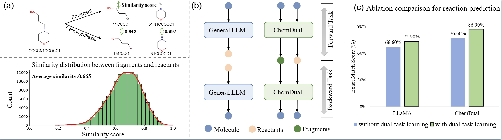
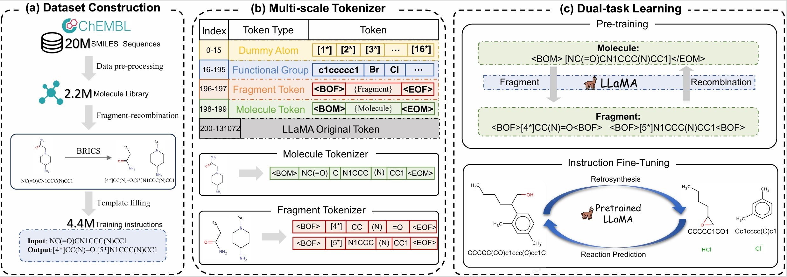
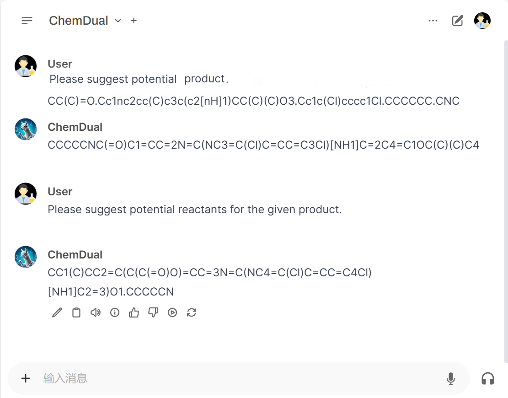

# ChemDual: Enhancing Chemical Reaction and Retrosynthesis Prediction with Large Language Model and Dual-task Learning
Codes for our paper *Enhancing Chemical Reaction and Retrosynthesis Prediction with Large Language Model and Dual-task Learning*

Full version is available at [arXiv](https://arxiv.org/pdf/2505.02639).

Appendix is available at [Here](/assets/Appendix.pdf)

<!-- *Visual instruction tuning towards large language and vision models with GPT-4 level capabilities.*-->


## Overview
<p align="center">
    <a>  </a>
</p>
Chemical reaction and retrosynthesis prediction are fundamental tasks in many fields of chemistry, forming the backbone of synthetic route design, compound optimization, and drug discovery. These tasks involve predicting the outcomes of chemical reactions and identifying potential synthetic pathways to create target molecules. Traditional approaches have relied heavily on expert knowledge and manual analysis, which are time-consuming and resource-limiting. With the advancement of computational technologies, automated methods have emerged as powerful alternatives to offer significant improvements in speed and efficiency for these critical tasks.

Large language models (LLMs) have gained more attention in various domains, they leverages advanced natural language processing techniques to process and analyze complex biochemical data. Recently, Mol-Instruction has show promising results in addressing the inherent challenges of chemical reaction and retrosynthesis prediction. Despite these advancements, LLMs still face the following two major challenges, which limit their accuracy in predictions of reaction and retrosynthesis compared with traditional machine learning models.

## Architecture
We propose ChemDual, a large language model with multi-scale tokenizer and dual-task learning. The overview of ChemDual is shown in Figure, which is divided into three main modules. In the dataset construction module, we construct a 4.4M Molecule-Fragments database from 20M SMILES sequences with breaking of retrosynthetically interesting chemical substructures (BRICS). Subsequently, in the module of multi-scale tokenizer, we extend the tokenizer the existing tokenizer to capture molecular information at different scales such as reaction and fragment. Finally, in the module of dual-task learning, we use dual-task learning on molecules and fragment as well as reaction and retrosynthesis to help LLM learn informative representation.
<p align="center">
    <a>  </a>
</p>

## Release
- [2025/01/24] 🔥 We first release our code (including training and evaluation scripts).


## Contents
- [Install](#install)
- [Webserver](#Webserver)
- [Weights](#weights)
- [Dataset](#dataset)
- [Train](#train)
- [Evaluation](#evaluation)

## Install
```Shell
conda create -n ChemDual python=3.10 -y
conda activate ChemDual
pip install --upgrade pip
pip install -r requirements.txt
```

## Webserver
We are about to upload the model to Ollama, and you can run the following code.
<p align="center">
    <a>  </a>
</p>

```
ollama pull ChemDual
ollama run ChemDual
```

## Weights

### Component Weights Download
Create a folder named `checkpoints` in the root directory of this project. 
```Shell
mkdir checkpoints
cd checkpoints
```
Download the following weights and put them in the `checkpoints` folder.
```Shell
# Under the checkpoints folder
# get the weights for the LLaMA3.1 model (https://huggingface.co/meta-llama/Llama-3.1-8B-Instruct)
ln -s meta-llama/Llama-3.1-8B-Instruct
```

### ChemDual Weights
* TODO: coming soon

## Dataset
* TODO: coming soon


## Train
```
llamafactory-cli train conf/train_ChemDual.yaml
llamafactory-cli export conf/export_ChemDual.yaml
```

## Evaluation
See evaluation folder for detailed instructions on how to evaluate the model.

## Acknowledgement

- [LLaMA3.1](https://github.com/meta-llama/llama3): the main base-LLM we used.
